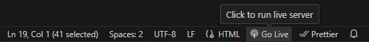
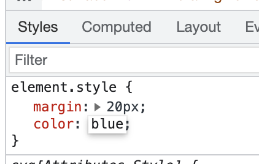

# Lab 1 - HTML
The goal of this lab is to help you familiarize with HTML tags, their properties and usages.
Completing the steps will require searching the answers on the Internet, which is the bread and butter of a software developer’s life. 

TIP: try to learn some VS Code keyboard shortcuts as you progress with this exercise - shortcuts can greatly simplify a web developer’s life.

## I. Template and Live Server
The template in the src folder contains a skeleton for your website that uses semantic HTML. 
There are two files: index.html and form.html because we'll be creating two separate pages and then linking them together using ```<a>``` tags.
Assets, like images, audio and video that you'll be using are in the assets directory.

### Steps:
1. Open the src folder in VS code and take a look at the template HTML files

2. With index.html opened, start the Live Server extension by clicking the Go Live button in the bottom right-hand corner of VS Code:



3. This should open http://127.0.0.1:5500/index.html in your browser. 

    -  Change the above URL to load the form.html page, and then click the Home link to go back to index.

### II. HTML elements - metadata
In this section you'll be editing the <head> section of the index.html file.

### Steps:
1. Add a title using the HTML title tag.

2. Add metatags using HTML <meta> tags for the following 5 items:
    - charset
    - description
    - keywords
    - author
    - viewport

## III. HTML elements - div, span, p, pre, ul, li, ol, article
In this section you'll be editing the <body> section of the index.html file.

### Steps:
1. Add 3 divs next to each other at the beginning of the body section and put some distinctive content into each of the divs,  e.g.
```html
<div>HTML</div> <div>CSS</div> <div>JavaScript</div>
```

2. Below the divs, add 3 spans next to each other and put some distinctive content into each span. Observe the difference between block and inline elements in the browser.

TIP: In VSCode, you can highlight your code and then press Ctrl+K+F to auto-format the code. VSCode won't auto-format if code is invalid with tags that are improperly closed or nested.

3. Below, add p and pre tags into your HTML body using the below contents:
```html
<p>
p represents paragraph     without preserving      spacing
</p>
<pre>
Text in         a pre element
is displayed in a fixed-width
font, and it preserves
both      spaces and
line breaks
</pre>
```

Observe how the ```<pre>``` tag preserves the structure of the text inside, while the ```<p>``` tag collapses spaces and newlines.

4. Add an unordered list of 4 items to your page using ul and li tags.

5. Add an ordered list of 3 items to your page using ol and li tags.

6. Add a nested list of 2 items inside the last item of either the unordered or ordered list above.

7. Wrap all the elements you've created so far with an article tag.
```html
<article>
   <!-- Content added in previous points -->
</article>
```

8. Add a page headline - add an h1 tag above your article with any content, e.g. "My HTML learning journey"

9. Add an article headline - add an h2 tag within the article tag with any content, e.g. "Learning elements - div, span, p, pre, ul, li, ol, article". Consider the difference between the page headline and article headline.

## IV. HTML elements - Tables - table, thead, tbody, tr, td, th
In this section you'll be editing the <body> section of the index.html file.

### Steps:
1. Start by adding another article below the first one, with a unique h2 tag inside this newly created article.

2. Search the web for ‘HTML table’ and copy code you can find, e.g. from the Mozilla website:
```html
<table>
    <thead>
    <tr>
        <th>First header</th>
        <th>Second header</th>
    </tr>
    </thead>
    <tbody>
        <tr>
            <td>First cell - first row</td>
            <td>Second cell - first row</td>
        </tr>
    </tbody>
</table>
```

3. Create another row by copying a tr tag, together with its children, below the first row.

4. By default, tables don't have any styles. Add basic styling by copying the code below to the head section of the page:
```html
<style>
    table, th, td {
        border: 1px solid black;
    }
</style>
```

5. Add a third cell inside one of the rows. Observe how the table lost its shape.

6. Each table row needs to account for the same amount of columns, and violating this rule will cause your table to lose shape. Fix the table by adding the missing td tag on the other row/s.

7. Now the header is missing for the third column. Fix this by adding a colspan attribute to the first th tag to make it span two columns.

8. Add a third row with 2 columns to the table and add a rowspan="2" attribute to one of the td tags on the second row, then observe what happens.

## V. HTML elements - img, video, audio
In this section you'll be editing the <body> section of the index.html file.

### Steps:
1. Start by adding another article below the second one, with a unique h2 tag inside this newly created article.

2. Add an image to your website using the code below. Add a value for the alt attribute, and experiment with using one, then both of the width and height attributes to change the size of the image.
```html

```

3. Add a second image using the html_lab_image.jpg file from the assets folder. Give it an alt attribute and make it appear the same size as the first image.

4. Add a video using the example code below:
```html
<video controls width="250">
    <source src="/assets/flower.webm" type="video/webm">
    Sorry, your browser doesn't support embedded videos.
</video>
```

5. Add an audio element using the example code below, then add a caption to it using figure and figcaption:
```html
<audio controls src="/assets/t-rex-roar.mp3">
    Your browser does not support the <code>audio</code> element.
</audio>
```

6. Try removing the controls attribute and adding autoplay attribute to both audio and video tags. Observe the changes.

## VI. HTML elements - Forms - form, input, label, select, option, button
In this section you'll be editing the form.html file.

### Steps:
1. Add a form using a <form> tag like this:
```html
<form method="POST" action="http://127.0.0.1:5500/form.html">
</form>
```

2. Inside the form, add 2 text inputs - one for inputting first name and the second one for inputting last name.
    - Remember to add a label for each input. 
    - Wrap each input, together with its label, in a div to stack the inputs one below another.

3. Add 3 radio buttons using <input type="radio" ...>, allowing the user to select their favourite coding language.
    - Remember to label the inputs and add name and value attributes.
    - Wrap the radio buttons in a div to separate them from the other form fields.

4. Add 3 checkboxes using <input type="checkbox" ...>, allowing the user to select the types of vehicle they own.
    - Remember to label the inputs and add name and value attributes.
    - Wrap the checkboxes in a div to separate them from the other form fields.

5. Add a dropdown element to your form using ```<select>``` and ```<option>``` tags, allowing the user to choose the brand of car they own. 
    - Remember to label the dropdown and add a value attribute for each option.

6. Add a submit button at the end of the form:
```html
<button type="submit">Submit form</button>
```


## VII. Adding a link from Home to Form page
In this section you'll extend both pages so users can navigate between Home and Form pages by clicking a link in the navigation bar.

### Steps:
1. Add another ```<a>``` element, linking to the form page, inside the ```<nav>``` tag in both index.html and form.html. 

2. Test your links by clicking them to navigate to both pages.


## VIII. Inspecting the HTML
In this section you'll inspect the HTML that you've written on the page.

1. Use inspection tool – right click anywhere on the page and click ‘Inspect’

2. Select various elements on your website by clicking on them using the Elements tab of the Inspection tool. Observe how they are highlighted as you hover and click them.

3. Take a look at the CSS in the "Styles" subtab (under or right of the "Elements" tab) and try editing the CSS styles. For example you may try adding some of the following values:
```css
margin: 20px; color: blue; font-size: 24px;
```

4. Take a look at the screenshot ad use element.style {} to add new styles to selected HTML elements.

