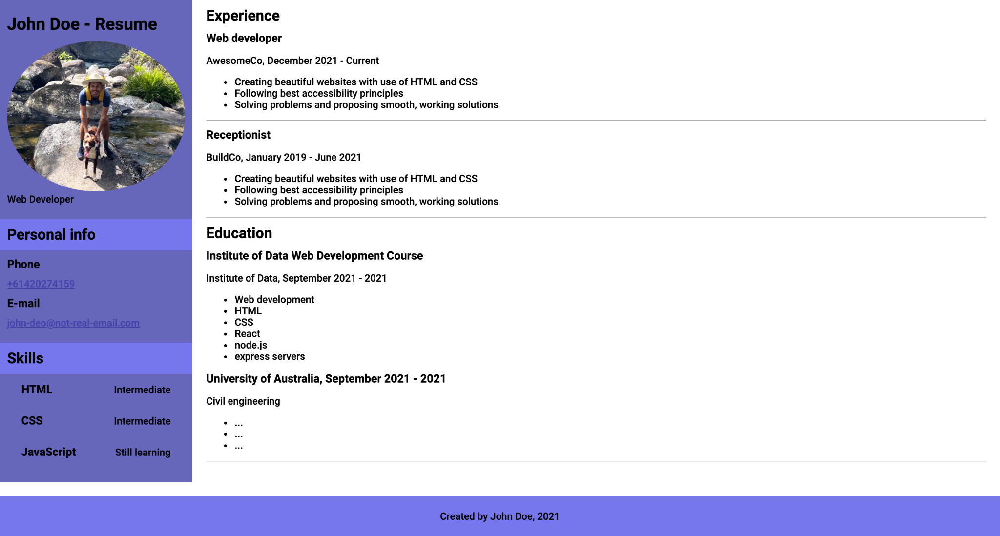

# Lab 4 - Build your own webpage

In this lab you will be building an entire webpage from scratch, to represent a basic resume for yourself using either real or invented details.

Use all the skills that you’ve learned:
    • Semantic HTML
    • Sections
    • Flexbox - layouts, centering elements and spacing elements into opposite corners
    • Images and setting border-radius
    • Box-model and setting margin, padding, width and height
    • Styling text
    • Styling links

For example, your resume may look like this:
